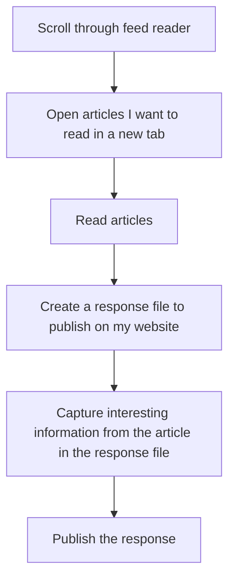

I like to use my [response feed](/feed/responses) to bookmark and reshare interesting content I find online. Typically my workflow looks like the following: 

The bottleneck I usually find is in the middle steps of creating a response file and capturing the relevant content. This usually happens as I'm reading the article. For a single file, it's not a big deal. Doing it for several can be time consuming, especially with the [number of feeds I subscribe to](/notes/subscribed-to-1042-feeds-newsblur).

There's a few things I think could help here:

1. Create one response file and do a daily link dump. 
1. Create a browser extension or system where I can:
    1. Highlight text or content on a page
    1. Right-click or use a keyboard shortcut to create an entry for the content I highlighted
    1. Create an entry in a database somewhere which captures the URL of the page I'm looking at.
    1. I enter a few more details like the file name I want to use and response type 
    1. When I'm done with my session, I can publish. This will use the database content to compose the content for my response and create a PR

The first option is simple but I don't like it because although most of the content I come across is tech related, I prefer having individual articles I can link to with their own tags to make it easier to build relationships.

The second option sounds complex, but it's basically a web highlighting tool. I know there's a few out there already so maybe worth checking out. 

I'd prefer to build my own to tailor it specifically to what I want just like my website generator. However, it would mean that I'd have to spend some time thinking about how to implement it. 

It'd be a fun project though. Maybe worthwhile experimenting with building an AI agent to help me use the content I captured to nicely format the response. 