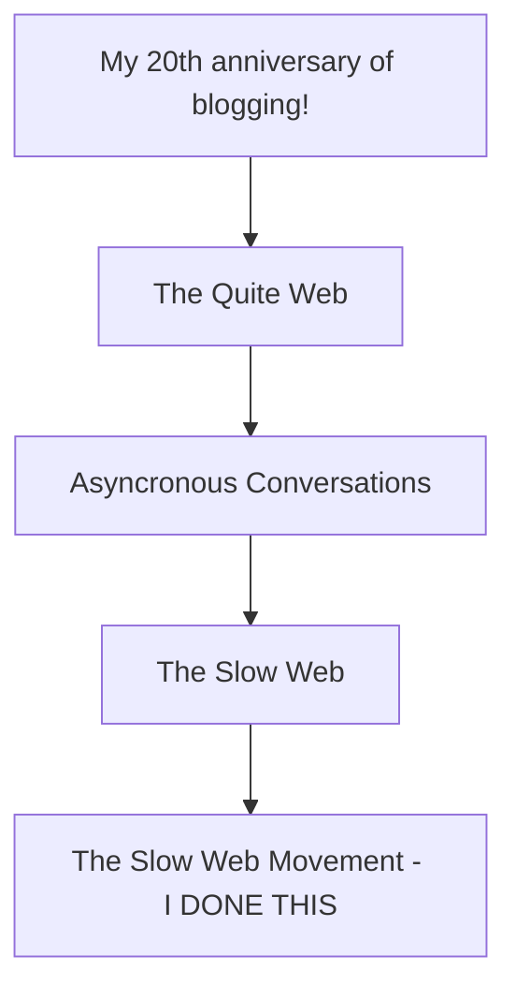

No real commentary on this post other than a web surf down the slow / quite web journey.

 
I'm nowhere near done reading these posts but here are others on the "To Read" stack based on the generous linking from all those posts.

- http://www.rebeccablood.net/archive/2010/06/a_slow_web.html?ref=jackcheng.com
- https://minimal.gallery/?ref=thegallery.io
- https://thecreativeindependent.com/essays/laurel-schwulst-my-website-is-a-shifting-house-next-to-a-river-of-knowledge-what-could-yours-be/
- https://manuelmoreale.com/quiet-web
- https://briankoberlein.com/blog/in-the-darkness-bind-them/
- https://jeremysarber.com/
- https://100r.co/site/home.html
- https://datagubbe.se/
- https://invisibleup.com/
- https://bicompact.space/
- https://river.cat/
- https://www.peppercarrot.com/
- https://everythingchanges.us/blog/writers-and-talkers-and-leaders/
- https://abeautifulmess.com/is-blogging-dead/
- https://tracydurnell.com/2023/08/27/performing-yourself-on-social-media/
- https://catvalente.substack.com/
- https://tracydurnell.com/blogroll/
- https://tracydurnell.com/2023/04/09/thinking-with-paper/
- https://tracydurnell.com/2022/11/26/article-pairing-is-blogging-self-indulgent/
- https://tracydurnell.com/2023/08/27/blogs-are-written-for-people-not-search/
