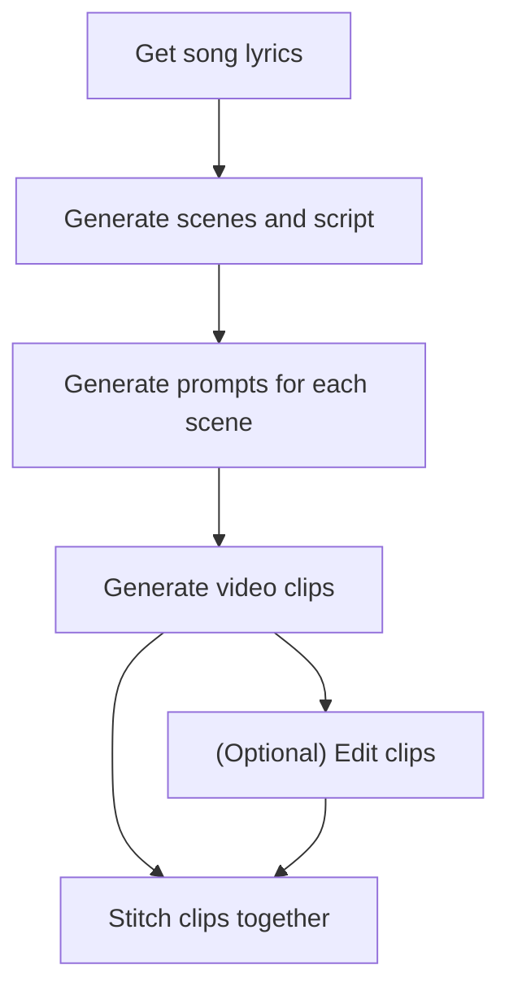

## Introduction

While listening to music on Spotify last night, this thought hit me. It's been cooking for some time so now you get to read about it. Spotify and YouTube, if you build this into your platforms for songs or podcasts, [contact me](/contact) for info on where to send the check :joy:. As the title of the post suggests, this is a thought experiment on how you might use Generative AI to produce Spotify Clips. This is not limited to songs but could also be extended to audio-only podcasts. However, given the long-form nature of podcasts it might be extremely resource intensive to produce clips per episode. This post is not exactly a how-to guide, though there are some practical examples of how some of the steps in the workflow might work using [Microsoft Copilot (formerly Bing Chat)](https://copilot.microsoft.com/).

## Spotify Clips

Let's start off by talking about what Spotify Clips are. Back in March of 2023, [Spotify introduced Clips to their platform](https://artists.spotify.com/blog/spotify-clips-get-started-short-form-video-stream-on). Spotify describes [Clips](https://clips.byspotify.com/) as "short, under-30-second vertical videos that are uploaded directly to Spotify for Artists. They’re designed to put you and your music front-and-center, so they can be attached to your artist profile, to a song, to an album, or to an upcoming release.". When paired with a song, you can think of them as short music videos. Music videos being the videos made to accompany songs that played on TV channels like Music Television (MTV) before Jersey Shore and Catfish. Music videos are still in production today and they generally serve the same purpose. They provide a visual representation of the story being told by the song.  

## Generative AI for video

An overwhelming majority of Generative AI models only generate text. With models like DALL-E and Stable Diffusion, you can also generate images. Other models to generate audio and video have started coming on the scene. Most recently, Google announced [VideoPoet](https://blog.research.google/2023/12/videopoet-large-language-model-for-zero.html), a large language model for zero-shot video generation. There's many interesting techniques that VideoPoet introduces but I'll keep it to one of the more simple scenarios and the technique used in this post, text-to-image. Given a text prompt, VideoPoet can generate by default, a short 2-second clip. You can use VideoPoet as well to extend a clip so you could go well beyond the default 2 seconds. That however is outside the scope of this post. With that in mind, let's talk about how we might use a Generative AI model and apply it to the context of Spotify Clips.

## Generative AI Spotify Clips workflow

The following is a rough idea of how you might use song information like lyrics to 



This is roughly what Google did in their VideoPoet samples. They "...produced a short movie composed of many short clips generated by the model. For the script, we asked Bard to write a series of prompts to detail a short story about a traveling raccoon. We then generated video clips for each prompt, and stitched together all resulting clips". The resulting video looks like the following:

[](https://www.youtube.com/watch?v=70wZKfx6Ylk "An AI generated video of a traveling racoon demoing VideoPoet AI model capabilities")

One thing to note is that the videos generated are YouTube Shorts which are vertical as well. This makes it easier to produce videos in the format Spotify expects Clips to be in.

## AI Generated Spotify Clips in practice

Now that we know the general process, what does it actually look like in practice? To help me with that, I used Microsoft Copilot.

### Generate scenes and script

In the example shared by Google, they used a prompt to generate a script made up of a series of prompts. In the case of songs on Spotify, we can use that as context and the starting point for our script. From there, we can ask Copilot to compose scenes for the verses in the song. We can also make sure as these scenes are generated, that there is a smooth transition between them and the storytelling is consistent. 

Let's take a look at what this might look like using the Chicano Batman song "A Hundred Dead and Loving Souls". Why that one? Just check out my [Spotify Wrapped](/feed/spotify-wrapped-2023). The general theme of that song is about the cycles of life experienced across millenia and generations. 

**Prompt**

Given the following prompt:

```text
Using the song information below as context, generate a script for a story that visually represents the song lyrics. Ensure that the script is broken down into individual scenes and the scenes are linear and cohesively transition.

<song>
<title>A Hundred Dead and Loving Souls</title>
<lyrics>
I am the sand stuck under miles of rock
watching the dry air sweep away my thoughts
as we travel protected by shards of glass
driving through the history of a million memories

In a sea of a hundred dead and loving souls
In a sea of a hundred dead and loving souls
In a sea of a hundred dead and loving souls
Climbing a thousand unclimbed trees
I don't know I want to know how it would feel
to be on top of one of these!

I am the root
quickly ascending
up through the surrounding dirt
quickly devoured by a hungry sun
quickly devoured by a hungry son
who is my father
and we are alike
we look alike we talk alike
we are alike
we are alike
we are alike we look alike
we talk alike

Thats why Im hungry
like the bellowing sky
this is no lie
as sure as light
entering eye
want to stay high
everything's cool too cool so cool
and I remember that everything falls

So I take a look around me now, as I speak
and I imagine a disinterested crowd
talking aloud
and I think of what I want most
and the crowd disappears
and a fixated gaze envelopes my wondering mind
and then she recruits and takes me to this place
I've been there before and that's where I saw her face

In a sea of a hundred dead and loving souls
In a sea of a hundred dead and loving souls
In a sea of a hundred dead and loving souls
Climbing a thousand unclimbed trees
I don't know I want to know how it would feel
to be on top of one of these!
</lyrics>
</song>

Story: 
```

**Response**

The response looks like the following:

```text
# Script for A Hundred Dead and Loving Souls

## Scene 1: The Sand
- A close-up shot of a grain of sand under a microscope, showing its intricate structure and texture.
- The camera zooms out to reveal that the sand is part of a vast desert landscape, with dunes and rocks stretching to the horizon.
- A voice-over of the protagonist (a young man) narrates the first verse of the song, expressing his feelings of being trapped and forgotten under the weight of the world.
- The camera pans to show a car driving on a dusty road, with the protagonist and his father inside. They are both wearing sunglasses and hats to protect themselves from the sun.
- The car is filled with boxes and bags, indicating that they are moving to a new place.
- The father is driving and listening to the radio, while the protagonist is looking out the window, bored and restless.
- The radio plays a news report about a nuclear fusion experiment in South Korea, followed by a song by a popular band.
- The father comments on the news, saying that it is a breakthrough for humanity and that he hopes to see it in his lifetime.
- The protagonist does not respond, but thinks to himself that he does not care about anything anymore.

## Scene 2: The Sea
- A montage of shots showing the protagonist and his father arriving at their new home, a small town by the sea.
- The father is excited and optimistic, while the protagonist is indifferent and detached.
- The father unpacks their belongings and sets up their new house, while the protagonist wanders around the town, exploring the beach, the pier, and the streets.
- The protagonist sees a group of teenagers hanging out at a skate park, laughing and having fun. He feels out of place and lonely.
- The protagonist walks to the edge of the pier, where he sees a sign that says "No diving".
- He looks down at the water, where he sees hundreds of dead fish floating on the surface, victims of a recent oil spill.
- He hears the chorus of the song in his head, imagining himself diving into the sea of a hundred dead and loving souls, and climbing a thousand unclimbed trees.
- He wonders what it would feel like to be free and alive, instead of being stuck and dead inside.

## Scene 3: The Root
- A flashback scene, showing the protagonist as a child, playing in a garden with his father.
- The father is a botanist, and he teaches his son about different plants and flowers, showing him how to care for them and appreciate their beauty.
- The son is curious and eager, and he asks his father many questions about the natural world.
- The father tells his son that he is a root, quickly ascending up through the surrounding dirt, and that he will grow into a strong and beautiful tree one day.
- The son smiles and hugs his father, saying that he loves him and that he wants to be like him.
- The father smiles and hugs his son back, saying that he loves him too and that he is proud of him.

## Scene 4: The Sun
- A flash-forward scene, showing the protagonist as a young adult, working in a laboratory with his father.
- The father is a nuclear physicist, and he is working on a project to harness the power of nuclear fusion, the same process that fuels the sun.
- The son is his assistant, and he helps his father with the experiments and calculations, following his instructions and commands.
- The father tells his son that he is a hungry sun, quickly devoured by a hungry son, and that he will make a great contribution to science and humanity one day.
- The son nods and agrees, but he does not look happy or satisfied. He feels pressured and obligated to follow his father's footsteps, even though he does not share his passion or vision.
- The son thinks to himself that he is hungry, like the bellowing sky, and that he wants to stay high, away from the reality and expectations that weigh him down.

## Scene 5: The Crowd
- A present-day scene, showing the protagonist at a party, surrounded by a crowd of people.
- The party is hosted by one of the teenagers that he saw at the skate park, who invited him out of pity and curiosity.
- The party is loud and chaotic, with music, drinks, and drugs everywhere.
- The protagonist feels uncomfortable and anxious, and he does not fit in with the crowd. He does not know anyone, and no one knows him.
- He tries to make small talk with some of the guests, but they are either rude, bored, or high, and they do not pay attention to him.
- He feels invisible and insignificant, and he wishes he could disappear.
- He takes a look around him, as he speaks, and he imagines a disinterested crowd, talking aloud, and he thinks of what he wants most.

## Scene 6: The Gaze
- A close-up shot of a pair of eyes, staring intently at the protagonist.
- The eyes belong to a girl, who is also at the party, but who is different from the rest of the crowd. She is quiet and mysterious, and she has a captivating and mysterious aura.
- The girl notices the protagonist, and she is intrigued by him. She sees something in him that no one else sees, something that she relates to and understands.
- She walks up to him, and she introduces herself. She says her name is Luna, and that she likes his song. She says she heard him humming it to himself, and that she knows the lyrics by heart.
- The protagonist is surprised and confused, and he asks her how she knows his song. He says he wrote it himself, and that he never shared it with anyone.
- The girl smiles and says that she knows his song, because she wrote it too. She says she has a gift, or a curse, depending on how you look at it. She says she can hear the songs that people sing in their souls, and that she can sing them back to them.
- The protagonist is shocked and amazed, and he asks her to prove it. He asks her to sing his song, or any song that he knows.
- The girl nods and agrees, and she sings his song, word for word, note for note, perfectly. She sings it with emotion and expression, as if she wrote it herself.
- The protagonist is speechless and mesmerized, and he feels a connection with the girl that he never felt with anyone before. He feels like she knows him, and he wants to know her.
- The girl stops singing, and she looks at him with a fixated gaze, that envelopes his wondering mind. She says she likes him, and she asks him if he wants to go with her to a place that she knows.
- The protagonist nods and agrees, and he follows her out of the party, leaving the crowd behind.

## Scene 7: The Place
- A montage of shots showing the protagonist and the girl driving to a secluded spot in the woods, where they park their car and get out.
- The spot is a clearing, where there is a large tree, with a rope swing hanging from one of its branches.
- The tree is the only one of its kind in the area, and it stands out from the rest of the forest. It is tall and majestic, with green leaves and red flowers.
- The girl tells the protagonist that this is her place, and that she comes here often to escape from the world. She says she loves this tree, and that she calls it Luna, after herself.
- The protagonist tells the girl that this is his place too, and that he has been here before. He says he saw this tree in his dreams, and that he always wanted to climb it.
- The girl smiles and says that they have more in common than they thought, and that they are meant to be together. She says she wants to show him something, and she asks him to follow her.
- The girl climbs the tree, using the rope swing as a support. She is agile and graceful, and she reaches the top in no time.
- The protagonist follows her, using the rope swing as well. He is clumsy and nervous, and he struggles to keep up with her.
- The girl reaches the top of the tree, where she finds a small platform, made of wood and rope. She sits on the platform, and she looks at the view.
- The view is breathtaking, and it shows the sea, the town, and the sky, all in one panorama. The sun is setting, and it casts a golden glow on everything.
- The girl waves at the protagonist, and she invites him to join her. She says this is the best place to watch the sunset, and that she wants to share it with him.
- The protagonist reaches the top of the tree, where he joins the girl on the platform. He sits next to her, and he looks at the view. He is awestruck, and he agrees that this is the best place to watch the sunset.
- The girl leans in and kisses the protagonist, and he kisses her back. They embrace each other, and they watch the sunset together.
- The chorus of the song plays in the background, as the scene fades to black.
```

Not too bad for a first pass. From here you might want to continue tweaking the different scenes but at least you have a starting point. 

### Generate prompts for each scene

Using the text-to-image technique, I first need to generate prompts to guide the model in the video generation process. In the case of this sample, you could take each of the bullet points in the scenes and generate a video for each of them. 

At the time of this writing, I didn't have access to a video generation model and I don't think VideoPoet is open to the public yet. Therefore, I had to slightly modify what I was generating. Instead of generating a video, I used Copilot to generate images using DALL-E. The concept is the same, except instead of generating videos, I'm generating still images. 

I could've applied the same concept of one image per bullet point. However, for brevity, I chose to summarize all of the bullet points in a scene into a single prompt. 

**Prompt**

Given the following prompt:

```text
Using storyboarding techniques, for each scene, generate a single prompt to use as input for DALL-E to generate an image. Since there are 7 scenes, there should be only 7 prompts. Distill as much of the concepts from each of the bullet points in each scene.
```

**Response**

The results from that prompt are the following:

```text
Scene 1: The Sand
    A grain of sand under a microscope and a car driving on a dusty road in a desert
Scene 2: The Sea
    A boy standing on a pier looking at a sea of dead fish and a sign that says “No diving”
Scene 3: The Root
    A father and a son playing in a garden with different plants and flowers
Scene 4: The Sun
    A father and a son working in a laboratory with a nuclear fusion reactor
Scene 5: The Crowd
    A boy at a party surrounded by a crowd of people with music, drinks, and drugs
Scene 6: The Gaze
    A girl with a pair of eyes that can hear the songs that people sing in their souls
Scene 7: The Place
    A boy and a girl sitting on a platform on top of a tree with a rope swing and a view of the sea, the town, and the sunset
```

Again, not too bad for a first pass. The main points of the scene are captured. I can already foresee there are a few scenes like "The Sand" which might be difficult to illustrate in a single image. 

### Generate images (video clips)

Now that we have individual prompts, it's time to generate some images. Again, I'm doing this because I don't have access to a video generation model but the process would be generally the same. 

**Prompt**

```text
Use the prompts for each of the scenes to generate images with DALL-E. Render them as pencil art.
```

**Response**

For brevity, I'll only include some of the images generated:

"The Sand"


"The Sea"


"The Root"


The pencil art part was something I thought would look nice to illustrate this instead of digital art or photorealism. That was a personal choice though. 

As we can see from the images, in general they're not too bad. When not condensed into a single image though and you have an image or video per frame in a scene, the generated content can be richer. 

### Edit and stitch videos

For the image generation example, this seems like a natural stopping point. However, with videos, you can imagine using AI to edit these videos. The VideoPoet post mentions how you might be able to do that. Part of that editing might also include lengthening the video clips. Once you're happy with your videos, you would then stitch them together to compose a larger clip. 

## Improvements

Tons! I used the simplest tools available at hand to validate whether my idea is feasible.  

### Videos

The most obvious improvement here would be to actually generate the videos. Whether that's using VideoPoet or another video generation model, the whole point is to end up with a video clip to upload to Spotify.

### Prompts

The prompts I used were not complex at all. I tried to keep them as simple as possible and in many cases, I wasn't the one providing the prompts, Copilot generated them for me. I would try to use more complex prompts to further guide the model in the formats I expect the outputs to be in and give more details for the model to generate better results. 

### Code

All of this was done using Copilot in the browser. As a starting point to validate my ideas this was fine. However, this approach is not composable, testable, reproducible, or scalable. I'd convert these steps to code in order to get all of the things Copilot doesn't give me. 

### Timestamp sync

One of the features Spotify offers is lyrics that are synced to the song. Similarly, being able to sync these generated clips to the song would be important so the visuals match the 

## Challenges

### Consistency

One challenge that someone brought up when I was explaining this idea was, how do you ensure that the visuals are consistent throughout all of the video clips.

That is a great question I don't have a great answer for, though I have ideas. 

If there aren't many changes throughout scenes, you could just opt to keep lengthening the video clip. 

If there are flashbacks or different visuals between scenes, you might achieve consistency by  using the image-to-video modality. Using a snapshot from a frame in a previous video clip, you might try to edit that snapshot to use in between transitions and then lengthen the video to produce the next scene. 

### Power Consumption

As fascinating as this is, is it worth the energy and cooling demands it requires when using large models? Maybe not in its current form, but maybe it makes sense when using smaller models or more power efficient compute. 

### People

For music videos, there's a human element to it both from the performers and the people who produce them. Again, the Generative AI is impressive and for someone like me without any artistic skills, it can be an empowering tool. Although I'm tempted to see what an [AI Rickroll](https://www.youtube.com/watch?v=dQw4w9WgXcQ) might look like, I prefer the human version. :slightly_smiling_face:

## Conclusion

In this post I discussed how you might use Generative AI models like VideoPoet to generate short videos for Spotify Clips. Since I don't have acess to VideoPoet or other video generation models at this time, I decided to show practical image generation examples instead using models like DALL-E to illustrate the general concepts. It's not wihtout its challenges and there's a ton of improvements I can think of but it was a fun experiment regardless. What else would you use these Generative AI models for? 

You can find an addendum to this post [here](/feed/genai-spotify-clips-instrumental).