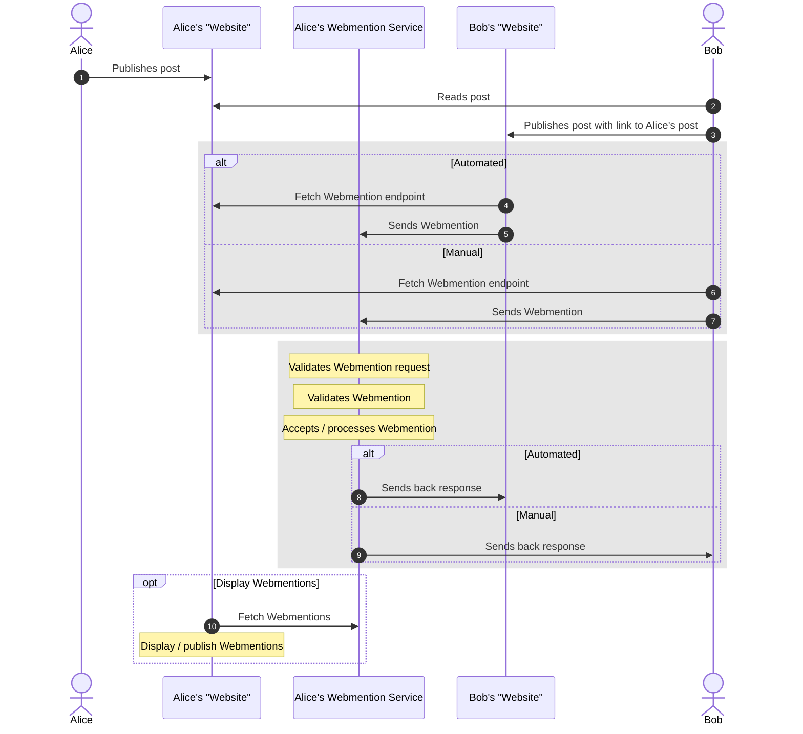

# Introduction 

> This post is part of [F# Advent 2022](https://sergeytihon.com/2022/10/28/f-advent-calendar-in-english-2022/). Thanks to [Sergey Tihon](https://sergeytihon.com) for organizing it. 

While not planned this way, this post is timely considering recent developments in the social media space. While Twitter is in the headlines, it's not the only time people have questioned their engagement and relationship with these social media platforms. In the context of Twitter though, users have been looking for alternative platforms to best serve their communities. While Mastodon and the Fediverse appear to be one of those alternatives, they're not the only one. Blogosphere platforms like Tumblr and WordPress, both owned by Automattic, are also positioning themselves as viable alternatives to the point they've [considered the idea of supporting ActivityPub](https://techcrunch.com/2022/11/21/tumblr-to-add-support-for-activitypub-the-social-protocol-powering-mastodon-and-other-apps/). ActivityPub is the protocol that powers many of the platforms on the Fediverse. However, it's not the only open protocol that enables communication and engagement on the open web. Webmentions is another protocol for enabling conversations on the web which I'll talk about more in this post. 

I'll also discuss how I used F#, Azure Functions, and RSS to implement a solution that helps me and my website engage in conversations on the open web thanks to Webmentions. 

## What are Webmentions?

First, let's start by talking a bit about Webmentions. 

According to the W3C specification, Webmentions are "...a simple way to notify any URL when you mention it on your site. From the receiver's perspective, it's a way to request notifications when other sites mention it.". 

One of the goals according to the IndieWeb wiki is to enable cross-site conversations.  

Here's how a potential Webmention workflow might look like:



I use the term website here very loosely because it's not only limited to your own personal website. You can technically use Webmentions through any public website including social media platforms like Twitter, Mastodon, or even GitHub.

This post will focus on the middle blocks consisting of sending and receiving Webmentions. For more information, check out the [specification](https://www.w3.org/TR/webmention/#abstract-p-1) and [Webmentions page](https://indieweb.org/Webmention) on the IndieWeb wiki. 

## My webmention solution

In September of this year, I [integrated a partial implementation of Webmentions](/notes/webmentions-partially-implemented/) into my website. This implementation only allowed me to send webmentions as part of my publishing process. If you're interested in the details, it's based on the blog post I wrote for last year's F# Advent, [Sending Webmentions with F#](/posts/sending-webmentions-fsharp-fsadvent/).

A couple of days ago, I [successfully deployed and integrated](/notes/now-accepting-webmentions) the other part of the implementation which allowed me to receive webmentions. While there are many great [services](https://indieweb.org/Webmention#Publisher_Services) which will do this for you, I decided to roll my own for fun and to learn something new. 

To help with that, I released [WebmentionFs](https://www.nuget.org/packages/lqdev.WebmentionFs), an open-source .NET library written in F# with components for sending and receiving Webmentions.

The backend service I use to receive webmentions is built on Azure Functions. 

If you're interested, here's the source code for [WebmentionFs](https://github.com/lqdev/WebmentionFs) and my [Webmention service](https://github.com/lqdev/WebmentionService). 

Before diving into the technical details of the solution, I'll first discuss some of the priorities driving my design decisions. 

### Requirements

While I don't want to trivialize it, at the end of the day, the Webmention service is just an endpoint that accepts HTTP POST requests. That means there's many ways to build it. However, here were the requirements important to me that guided my design choices:

- **Cost:** The solution should be low cost
- **Maintenance:** The solution should be easy to maintain
- **Easy to consume:** I have multiple ways to view and access my webmentions.
- **Notifications first:** Since I don't own or have responsibility over content that's not mine, prioritize Webmentions for notifications, not content.

With that in mind, I ended up choosing a solution built on Azure Functions to receive Webmentions and publish them as an RSS feed. 

### Why Azure Functions?

I don't make money from my website. It's a labor of love in which I document my experiences. Selfishly, it's for me to remind myself how to solve a problem or share something that was important to me at that time. If my posts end up helping others solve their own problems, that's a side effect and a reward unto itself. To that effect, I want my website to be as low-cost to run as possible. One way I achieve that is by using static hosting. This dramatically reduces the cost associated with my site. If you're interested in how this site is built, you can check out the [colophon](/colophon).

So where do Azure Functions come in? 

Azure Functions is a serverless solution which means there are no servers! (I kid :smirk:)

#### Cost :heavy_check_mark:

As a serverless solutions, it means web services are not constantly running. They only run whenever there is something to process so I only pay for what I need. That takes care of my low-cost requirement since processing Webmentions is not a long-running, resource-intensive operation that can easily run in a serverless environment.

#### Maintenance :heavy_check_mark:

Cost is not only monetary. There are also time costs associated with maintaining a solution. Because there is no infrastructure to maintain, that's not really a factor I need to consider. Instead I get to focus on writing the logic for accepting and processing Webmentions. Azure Functions provides a set of [prebuilt trigger and binding components](https://learn.microsoft.com/azure/azure-functions/functions-triggers-bindings) to reduce the amount of code I have to write to handle things like accepting HTTP requests or storing data in a table or blob storage. Also, in the rare instance that this blog post breaks the internet, Azure Functions enables my service to automatically handle that scale. Don't believe me? Check out this post frorm [Troy Hunt](https://www.troyhunt.com/) on [Have I Been Pwned usage of Azure Functions](https://www.troyhunt.com/serverless-to-the-max-doing-big-things-for-small-dollars-with-cloudflare-workers-and-azure-functions/).

### Why RSS?

The choice of how to display and consume Webmentions is entirely up to you. At regular intervals, my Webmention service generates an RSS feed and publishes it to a private Azure Blob Storage. Here are some of the reasons why:

#### Easy to consume :heavy_check_mark:

The decision to use RSS comes from the fact that like Webmentions, it's an open protocol that gives choice to creators and consumers. Check out my post, [Rediscovering the RSS protocol](/posts/rediscovering-rss-user-freedom) for more of my thoughts on that. Despite the appearance of decline in use, it's a protocol that's been around for over 20 years and it's one of the many reasons why podcasts continue to be one of the more open platforms despite some attempts to lock down the ecosystem.  With that it mind, by choosing RSS as the publishing format for my Webmentions feed, I can lean on the vast number of RSS readers ([NewsBlur](http://newsblur.com/) and [Elfeed](https://github.com/skeeto/elfeed) being my favorites) out there instead of having to write a custom UI. Not happy with my RSS reader? I can just add my feed to whichever other reader I move to and continue consuming my Webmentions without skipping a beat. 

### Notifications first :heavy_check_mark:
 
While not technical or specific to RSS, this is a topic I wrestled with as part of my implementation. However, choosing RSS made many parts of it simpler. 

Who owns your content? If you publish on your own website or a platform under your control, chances are you do. If I publish and redistribute your content on my website though, what parts do I own and which parts do you? I'm not sure. What about spam, harrassment, and lewd content? I'd have to put in place some sort of moderation instead of publishing directly on my site. I didn't want to have to deal with any of these questions so choosing to publish to a private RSS feed instead of directly on my site made it so Webmentions are for my eyes only. More importantly, I only capture the source and target links, not the content. Therefore, I don't store or redistribute your content. Now there's nothing stopping anyone from seeing your post since it's public but in cases where your site's content is not something I'm comfortable with, I'm not resharing or redistributing that content. If my RSS reader chooses to display the full contents of your post by using the `link` element from the RSS feed, since your post is public, that's no different than me viewing the original post on your site. If at some point I feel differently about it, the changes to capture the content in the `description` happen at the RSS file level and because the RSS is private, I'm still not redistributing your content. 

In short, with my implementation I chose to prioritize Webmentions for notification purposes rather than building a commenting and interaction (like, reshare) system for my website. 

Now that I've talked about the what and the why, in the next sections I'll get into the how. 

## Sending Webmentions

Once you've created a post linking to someone else's website, sending webmentions is a two-step process:

1. URL discovery of webmention endpoint
2. Send webmention

These steps can be automated or performed manually. 

### URL discovery of Webmention endpoint

The first thing you'll need is the endpoint where you'll be sending your Webmention to.

According to the Webmention specification, a Webmention endpoint can be found in one of three places:

- HTTP response headers
- `<link>` tag with `rel=webmention` attribute
- `<a>` tag with `rel=me` attribute

When this process is automated, the discovery is performed in order and each subsequent option works as a fallback of the other. When done manually, either the website author will publish and advertise this on their website or you can inspect the website's source code to find it.  

### Send webmention

To send a Webmention, you need to send an HTTP POST request with an `x-www-form-urlencoded` body containing two properties: `source` and `target`. Source is the URL of your article and target is the URL of the original article. Again, this too can either be automated or done manually with tools like cURL, Insomnia, or any other HTTP client.  

### Sending Webmentions in practice

Let's use a redundant example to walk through the workflow. Pretend that you created or commented on a GitHub issue and added a link to one of my articles, [Sending Webmentions with F#](/posts/sending-webmentions-fsharp-fsadvent/) for example. You then wanted to notify me either to get my attention on that issue or just as an FYI. Now I say this is a redundant example because GitHub already has notifications. However, what this does illustrate are the cross-site capabilities of Webmentions. 


At this point, if GitHub implemented Webmentions, it would automatically:

1. Fetch my webpage and look for my Webmention endpoint.
1. Compose and send the HTTP POST request.  

Sadly, today that's not the case so we'll walk through the workflow manually.  

On my website, I include a `link` tag with the `rel=webmention` attribute that looks like the following:

```html
<link rel="webmention" title="Luis Quintanilla Webmention Endpoint" href="https://lqdevwebmentions.azurewebsites.net/api/inbox">
```

My current Webmention endpoint is *https://lqdevwebmentions.azurewebsites.net/api/inbox*.

Now that you have the Webmention endpoint, you could use any tool of your choice to create and send the HTTP POST request. I have made it simpler though and included a form on my website for each of my posts for this purpose. 


The source code looks like the following:

```html
<div>
    <script type="application/javascript">window.onload = function() { document.getElementById('webmention-target').value = window.location.href }</script>
    <form action="https://lqdevwebmentions.azurewebsites.net/api/inbox" method="POST" enctype="application/x-www-form-urlencoded">
        <h5 class="text-center">Send me a <a href="https://indieweb.org/webmentions">webmention</a></h5>
        <div class="form-row justify-content-center">
            <div class="w-75">
                <input type="text" name="source" class="form-control" placeholder="Your URL (source)">
            </div>
            <div class="col-auto">
                <input type="submit" class="btn btn-primary" value="Send">
            </div>
            <input readonly="" class="form-control-plaintext" style="visibility:hidden" type="text" id="webmention-target" name="target">
        </div>
    </form>
</div>
```

Now to send the webmention, navigate to the post you want to send a Webmention to. In this case, it's [Sending Webmentions with F#](/posts/sending-webmentions-fsharp-fsadvent/). Then, paste the link to the GitHub issue that contains the link to my site into the post's text box and hit "Send". 


At that point, the request is sent to my Webmention service which receives and processes the request and responds with a message whether the request was successful or not. 

That's all there is to it! Before moving the the receiving process though, I'll briefly show how to send Webmentions using WebmentionFs. 

### Sending Webmentions with WebmentionFs

In WebmentionFs, you can use the [`UrlDiscoveryService`](https://github.com/lqdev/WebmentionFs/blob/main/UrlDiscoveryService.fs) and [`WebmentionSenderService`](https://github.com/lqdev/WebmentionFs/blob/main/WebmentionSenderService.fs) to send Webmentions. If you wanted to integrate sending Webmentions into your application or service, here's an example that shows how you'd use those components.

```fsharp
open System
open WebmentionFs
open WebmentionFs.Services

let ds = new UrlDiscoveryService()

let ws = new WebmentionSenderService(ds)

let data = 
    {   
        Source = new Uri("https://twitter.com/ljquintanilla/status/1603602055435894784")  
        Target = new Uri("/feed/mastodon-hashtag-rss-boffosocko")
    }

ws.SendAsync(data) |> Async.AwaitTask |> Async.RunSynchronously
```

The main part to pay attention to is the `SendAsync` function. This uses the `UrlDiscoveryService` to perform the Webmention endpoint discovery and send the HTTP POST request with the provided data. 

## Receiving webmentions

Now that you know how to send webmentions, let's talk about what happens on the receiver end. At its core, it's about a three-step process:

1. Validate request
1. Validate Webmention
1. Process Webmention

### Validate request

Before processing the Webmention, you want to make sure that the request is valid. To do so there are a few checks you perform:

1. Is the protocol valid? Check that the protocol for the source and target URLs in the request body are HTTP or HTTPS.
1. Are the URLs the same? Check that the source and target URLS in the request body are NOT the same. 
1. Is the target URL a valid resource? This is more loosely defined and up to you. In my case I defined valid as: 
    - I own the domain
    - The target URL doesn't return an HTTP 400 or 500 error. 

If the request is not valid, nothing is done with the Webmention and an error returns. Otherwise, it moves to the next step which is Webmention validation. 

### Validate Webmention

In the base case, Webmention validation just means you parse through the source document and make sure that the target URL is included in it. However, if you wanted to get more complex and take into account specific types of interactions such as likes, replies, reposts, bookmarks, etc. you can parse through the document looking for [microformat](http://microformats.org/wiki/h-entry#Core_Properties) annotations. For more information on these annotations, see the [Types of Posts](https://indieweb.org/posts#Types_of_Posts) or [reply](https://indieweb.org/reply#Post_a_reply) pages in the IndieWeb Wiki. 

If the target link is NOT in the source document, you return an error. Otherwise, you move to the next step of processing the Webmention

### Processing Webmentions

This step is optional and loosely defined. Once you've validated the request and Webmention, you can do with it as you please. One thing you can do is publish it (after moderation) on your website. 

In my case, I'm storing it in an Azure Tables database. Then, every morning, I generate an RSS feed of all my webmentions and save it to a private container on Azure Blob Storage.  

## Reciving Webmentions with WebmentionFs

To receive Webmentions, I use the [`RequestValidationService`](https://github.com/lqdev/WebmentionFs/blob/main/RequestValidationService.fs), [`WebmentionValidationService`](https://github.com/lqdev/WebmentionFs/blob/main/WebmentionValidationService.fs) and [`WebmentionReceiverService`](https://github.com/lqdev/WebmentionFs/blob/main/WebmentionReceiverService.fs) inside my Azure Function. 

The source code for my Azure Function is available in the [WebmentionService GitHub repo](https://github.com/lqdev/WebmentionService).

The main components are in the `Startup.fs` and `ReceiveWebmention.fs` files. 

The [`Startup.fs`](https://github.com/lqdev/WebmentionService/blob/main/Startup.fs) files registers each of the services I'll use to to receive Webmentions. By doing so, I define the initialization logic for use later in my application using dependency injection. The main thing to note here is that the `WebmentionReceiverService` is initialized with instances of a `RequestValidationService` and `WebmentionValidationService`. For the `RequestValidationService`, it's initialized with a list of host names. In this case, I'm passing it in as a comma-delimited environment variable that looks something like "lqdev.me,luisquintanilla.me". This is what the `RequestValidationService` uses to check whether I own a domain.

```fsharp
// Add request validation service
builder.Services.AddScoped<RequestValidationService>(fun _ -> 

    let hostNames = Environment.GetEnvironmentVariable("PERSONAL_WEBSITE_HOSTNAMES")

    let hostNameList = hostNames.Split(',')

    new RequestValidationService(hostNameList)) |> ignore


// Add webmention validation service
builder.Services.AddScoped<WebmentionValidationService>() |> ignore

// Add receiver service
builder.Services.AddScoped<IWebmentionReceiver<Webmention>,WebmentionReceiverService>(fun (s:IServiceProvider) ->
    let requestValidationService = s.GetRequiredService<RequestValidationService>()
    let webmentionValidationService = s.GetRequiredService<WebmentionValidationService>()
    new WebmentionReceiverService(requestValidationService,webmentionValidationService)) |> ignore
```

Then, in the [`ReceiveWebmention.fs`](https://github.com/lqdev/WebmentionService/blob/main/ReceiveWebmention.fs) file, I inject my `WebmentionReceiverService` into the constructor and add all the logic for running my serverless function in the `Run` function. In this snippet, some code is ommitted for brevity.

```fsharp
type ReceiveWebmention (webmentionReceiver: IWebmentionReceiver<Webmention>) = 

    ///...

    [<FunctionName("ReceiveWebmention")>]
    member x.Run 
        ([<HttpTrigger(AuthorizationLevel.Anonymous, "post", Route = "inbox")>] req: HttpRequest) 
        ([<Table("webmentions", Connection="AzureWebJobsStorage")>] t: TableClient)
        (log: ILogger) =
        task {
            
            log.LogInformation("Processing webmention request")

            let! validationResult = x.WebmentionReceiver.ReceiveAsync(req)

            let response = 
                match validationResult with
                | ValidationSuccess m -> 
                    let entity = mapMentionToTableEntity m
                    try
                        t.AddEntity(entity) |> ignore
                        OkObjectResult("Webmention processed successfully") :> IActionResult
                    with
                        | ex -> 
                            log.LogError($"{ex}")
                            BadRequestObjectResult($"Error processing webmention. Webmention already exists") :> IActionResult
                | ValidationError e -> 
                    log.LogError(e)
                    BadRequestObjectResult(e) :> IActionResult

            return response

        }
```

The `Run` function is triggered whenever an HTTP POST request is made to my Webmention endpoint. It then calls `ReceiveAsync` on the `WebmentionReceiverService` which under the hood uses the `RequestValidationService` and `WebmentionValidationService` for validation. For reference, here's the code that does that in WebmentionFS.

```fsharp
member x.ReceiveAsync (data:UrlData) = 
    task {
        let! requestValidationResult = 
            x.RequestValidationService.ValidateAsync data

        match requestValidationResult with
        | RequestSuccess r -> 
            let! webmentionValidationResult = 
                x.WembentionValidationService.ValidateAsync r.Source r.Target

            let (result:ValidationResult<Webmention>) = 
                match webmentionValidationResult with
                | AnnotatedMention m -> 
                    ValidationSuccess {RequestBody = r; Mentions = m}
                | UnannotatedMention -> 
                    ValidationSuccess 
                        {
                            RequestBody = r
                            Mentions = 
                                {
                                    IsBookmark = false
                                    IsLike = false
                                    IsReply = false
                                    IsRepost = false        
                                }
                        }
                | MentionError e -> ValidationError e
            return result
        | RequestError e -> return ValidationError e
    }
```

> A quick side-note. I love how elegant function composition in F# makes the request validation pipeline look. See for yourself :slightly_smiling_face:
> 
> ```fsharp
>let validateAsync = 
>    isProtocolValid >> isSameUrl >> isTargetUrlValidAsync
>```

Inside my `Run` function, if the request and Webmention validation are successful, I use the Azure Table Storage table client `AddEntity` method to save the Webmention to a table. One thing to note is that `AddEntity` ensures that an entry is only added once. If an entry already exists in the table, it returns an error. 

This is what the GitHub Webmention we sent looks like in the table.


In this case, the `PartitionKey` is the target URL and `RowKey` is the source URL. The fact all other columns are set to false indicates this is an untagged mention with no special microformats annotations. Annotating your posts appropriately would set one or more of those columns to true. 

Now that we went over how I receive Webmentions, I'll show how I prepare my Webmentions for consumption. 

## Viewing Webmentions

I consume my Webmentions using RSS feeds and RSS readers. To do so, I have an Azure Function called [`WebmentionToRss`](https://github.com/lqdev/WebmentionService/blob/main/WebmentionToRss.fs) that triggers every day at 3 AM. This function queries the Azure Table Storage table containing my Webmentions and creates an RSS feed that's then stored to Azure Blob Storage. Like the other function to process my Webmentions, I:

Register the `RssService` responsible for generating the RSS feed in `Startup.fs`.

```fsharp
// Add RSS service
builder.Services.AddScoped<RssService>() |> ignore
```

Inject the service into my `WebmentionToRss` constructor. Then in my `Run` function, I call the `getMentions` helper function to query the table, call `BuildRssFeed` to generate the feed, and write it out to Azure Blob Storage using a `Stream`.

```fsharp
type WebmentionToRss (rssService:RssService) =

    let getMentions (t:TableClient) = 

        //...

        let webmentions = t.Query<WebmentionEntity>()

        webmentions


    //...

    [<FunctionName("WebmentionToRss")>]
    member x.Run
        ([<TimerTrigger("0 0 3 * * *")>] info: TimerInfo)
        ([<Table("webmentions",Connection="AzureWebJobsStorage")>] t: TableClient)
        ([<Blob("feeds/webmentions/index.xml", FileAccess.Write, Connection="AzureWebJobsStorage")>] rssBlob: Stream)
        (log: ILogger) =

        task {
            let mentions = getMentions t

            let rss = x.RssService.BuildRssFeed mentions "lqdev's Webmentions" "http://lqdev.me" "lqdev's Webmentions" "en"

            log.LogInformation(rss.ToString())                

            use xmlWriter = XmlWriter.Create(rssBlob)

            rss.WriteTo(xmlWriter) |> ignore
        }
```

Now, to view my feed I add the URL to the RSS file in Azure Blob Storage to my RSS feed reader. The container and blob containing the file are private though, so how does my RSS reader get access to the file? I don't use the direct link. Instead, I use a link containing a [Shared Access Signatures (SAS) token](https://learn.microsoft.com/azure/storage/common/storage-sas-overview#sas-token). 

The RSS feed reader then fetches my Webmentions feed at regular intervals. 

This is what the GitHub post looks like in my RSS reader.


That's all there is to it!

## What's next?

Overall I'm happy with my solution. I learned a few things along the way and got something working for myself. Publishing WebmentionFs as a library and making my Azure Function code open-source were attempts to help others looking to implement similar solutions get started. These solitions could be improved though. These are some updates I would like to make at some point:

- Upgrade my website to use WebmentionFs for sending Webmentions. You can see the [current implementation](https://github.com/lqdev/luisquintanilla.me/blob/main/Services/Webmention.fs) on my website repo which is basically what's in `UrlDiscoveryService` and `WebmentionSenderService` today. 
- Add interfaces for all services in WebmentionFs. Currently most services have concrete implementations. By adding interfaces, I can make the library extensible and you can implement your own URL discovery and validation services. 
- Implement `outbox` enpoint in WebmentionService to handle sending Webmentions.
- Create Azure ARM template for deploying WebmentionService. Currently with some small edits, you could fork and get my WebmentionService project working for your website. However, that process isn't turnkey today. Maybe using something like [Farmer](https://compositionalit.github.io/farmer/) would make onboarding easier for folks. 
 
## Conclusion

Webmentions are a great way to enable cross-site conversations on the internet. In this post, I provided a brief introduction to the general workflow for sending and receiving Webmentions. I also detailed my own implementation which I use today on my website. That implementation relies on the WebmentionFs .NET library, Azure Functions, and RSS. By using the WebmentionFs .NET library, you can more quickly implement similar solutions into your own apps and services. If you need a reference, check out my WebmentionService repository on GitHub which contains the code I use for receiving Webmentions. 

I'll leave you with three things:

1. As you consider the next platform for your next online home, in addition to considering the health of the community, take some time to also think about the protocols it's built on top of and whether they give you more or less freedom. 
1. Try out the WebmentionFs library on NuGet and add Webmentions to your site.
1. If you share this post anywhere publicly on the web, send me a Webmention.

Catch you on the world wide web!