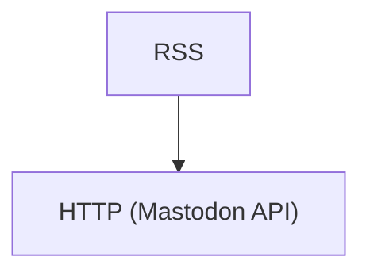

## Introduction

[Over the past year, I've made this website the main place where I post content](/feed/weblogging-rewind-2023). The easiest way to [subscribe to content on my website](/subscribe) is through the various RSS feeds. However, I have accounts on other platforms like X (formerly Twitter), Bluesky, and Mastodon where I'd still like to repost my content to. Since the [changes to the Twitter API](https://techcrunch.com/2023/03/29/twitter-announces-new-api-with-only-free-basic-and-enterprise-levels/), the only place I cross-post to is Mastodon. The main reason behind it is, as of now, it's one of the few platforms that allows me to automate post creation via its REST APIs without restrictions. A large part of that is I self-host my own Mastodon instance but I assume there aren't as many restrictions when using other instances like mastodon.social. The way I automate posting is by setting up workflows using Azure Logic Apps. These workflows subscribe to my various RSS feeds and whenever a new post is published, they make an HTTP request to my Mastodon instance to create a new post. I've been doing this for some time but never got around to documenting it. This blog post goes into more details about how to set up these workflows.  

## What is POSSE

[POSSE](https://indieweb.org/POSSE) is short for "Post on your Own Site Syndicate Elsewhere". It's one of the patterns adopted within IndiWeb communities and projects. The main idea is, your website or a website you own or have administrative rights to becomes the main platform where you publish your content. Effectively, it's the cannonical version of your content. Once your content is on your website, you can optionally choose to distribute it on other platforms. 

## What is RSS

[RSS](https://en.wikipedia.org/wiki/RSS) is short for Really Simple Syndication. Accorting to Wikipedia, this protocol "allows users and applications to access updates to websites in a standardized, computer-readable format". 

## What is Mastodon

[Mastodon](https://joinmastodon.org/) is an [open-source](https://github.com/mastodon/mastodon) decentralized microblogging platform built on the [ActivityPub](https://activitypub.rocks/) protocol and part of the larger collective of federated systems known as the [Fediverse](https://fediverse.info/). 

## What are Azure Logic Apps

If you've used workflow automation systems like [IFTTT](https://ifttt.com/), then you generally know what Azure Logic Apps are. 

A more formal definition from the Azure documentation - "Azure Logic Apps is a cloud platform where you can create and run automated workflows with little to no code. By using the visual designer and selecting from prebuilt operations, you can quickly build a workflow that integrates and manages your apps, data, services, and systems."

For more details, see the [Azure Logic Apps documentation](https://learn.microsoft.com/azure/logic-apps/logic-apps-overview).

## Prerequisites

Since you'll be creating Logic App Resources on Azure, you'll need an [Azure account](https://aka.ms/free).

## Create Consumption Azure Logic App Resource

There's various ways to create an Azure Logic App Resource but the easiest one for this relatively simple workflow is using the Azure Portal. For more details, see the [create a consumption logic app resource documentation](https://learn.microsoft.com/azure/logic-apps/quickstart-create-example-consumption-workflow#create-a-consumption-logic-app-resource).

For the most part you can leave the defaults as is. Since the intended use for this workflow is personal and I don't need enterprise features, I chose to create my logic app using the consumption plan. 

When prompted to choose **Plan Type**, select **Consumption**. 

## The Workflow

The workflow is relatively simple. Whenever a new item is posted to an RSS feed, make an HTTP POST request to the Mastodon API

Once your Logic App resource deploys to Azure, create a new logic app using the Blank Template. For more details, see the [select a blank template documentation](https://learn.microsoft.com/azure/logic-apps/quickstart-create-example-consumption-workflow#select-the-blank-template).

This will launch you into the Logic app designer UI where you can begin to configure your workflow.

### RSS trigger

The first thing you'll want to do is set up the trigger that initiates the workflow. The trigger in this case will be new posts on an RSS feed.

In the Logic app designer, search for *RSS* and add it as a trigger.

Once the RSS trigger is added to your workflow, configure it as follows:

- **The RSS feed URL**: The feed you want want to get posts from. In this case, I'm using my blog posts [feed](https://www.luisquintanilla.me/posts/index.xml). 

    **TIP: The RSS feed can be ANY feed. So if you wanted to subscribe and repost items from your favorite blog or website, you can as well. Just note though that if you don't own the content it might not be something the author wants you doing and for websites that update multiple times a day, it might produce a lot of noise in your feed. Other than that though, subscribe and post away!**

- **How often do you want to check for items?**: The frequency at which you want to poll the RSS feed and check for new posts. In my case, I don't post very often but I do want my posts to be published on Mastodon within an hour of publishing. Therefore, I chose 1 hour as the update frequency. 

### HTTP action

Now that your trigger is configured, it's time to do someting with the latest posts. In this case, since I want to create a new post on Mastodon, I can do so via their REST API. 

#### Get Mastodon credentials

One thing that you'll need to publish posts to Mastodon is an application token. The easiest way to get one is using the Web UI. 

To get your app credentials through the web UI:

1. In the Mastodon Web UI, select **Preferences**.
1. In the preferences page, select **Development**.
1. In the development preferences tab, select **New application**.
1. In the new application page:
  - Provide a name for your application
  - Choose the **write:statuses** scope checkbox. For details on required scopes to post statuses, see the [Post a new status REST API documentation](https://docs.joinmastodon.org/methods/statuses/#create)
  - Select **Submit**

If successful, this will create credentials and a token you can use to send authenticated requests to the Mastodon API.

#### Configure HTTP action

Now that you have your credentials, you can configure your HTTP action in the Logic Apps workflow.

In the Logic App designer:

1. Select **+ New Step**.
1. Search for *HTTP* and add it as an action. 
1. Once the HTTP action is added, configure it as follows:

- **Method**: The HTTP Method. To create statuses, choose **POST** from the dropdown.
- **URI**: The endpoint to make the requests to. For mastodon, it's `https://<HOST>/api/v1/statuses`. Make sure to replace `<HOST>` with your Mastodon instance. In my case, it's `toot.lqdev.tech` since that's where I host my mastodon instance. 
- **Headers**: HTTP Headers to use. In this case, set the following:

    | Key | Value |
    | --- | --- |
    | Content-Type | application/x-www-form-urlencoded |

- **Queries**: URL Query Parameters to add to the request. This is where you'll set your access token.

    | Key | Value |
    | --- | --- |
    | access_token | `[YOUR-ACCESS-TOKEN]` |

    Make sure to replace `[YOUR-ACCESS-TOKEN]` with the token credential generated in the Mastodon Web UI.
- **Body**: The content to be published in your Mastodon post. This is entirely up to you though at minumum, you'll add the following to the text feed. `status=<YOUR-CONTENT>`. `<YOUR-CONTENT>` is what will be displayed in the Mastodon post. 

    One of the nice things about Azure Logic Apps is, properties from previous steps are available to you in subsequent steps. Since our trigger is an RSS feed, we can get access to the feed and item properties of our feed in the HTTP action. If all you wanted was to post the tile and URL, you can do that using the **Feed title** and **Primary Feed Link** properties. For more details, see the [RSS connector documentation](https://learn.microsoft.com/connectors/rss/). 

## Save and run

That's it! Now you just need to select **Save** in the Logic app designer page. 

Once it's saved, click **Run trigger** which will kick off your trigger. If you have anything recent to publish and everything is configured correctly, it should show up in your Mastodon feed.

## Conclusion

By publishing content on your own website first, you're in full control of your content. Regardless of which platforms come and go, you won't have to adjust to those changes because your content is not locked in to those platforms. However, that doesn't mean you can't also publish your content there. Using protocols like RSS make it easy to subscribe to updates on your website. Using REST APIs provided by the respective platforms, you can automate publishing these updates. To further automate and simplify this process, you can use services like Azure Logic Apps to make publishing to all places easy. 