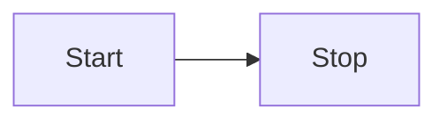

## Overview

Markdig advanced extensions are a series of CommonMark compliant syntax extensions for the markdown language. 

## Task lists

Tasks lists allow you to create unorder list items with checkboxes.

### Syntax

```markdown
- [ ] Item1
- [x] Item2
- [ ] Item3
```

### Output

- [ ] Item1
- [x] Item2
- [ ] Item3

## Tables

### Pipe tables

#### Syntax

```markdown
| a | b | c
| - | - | - 
| 1 | 2 | 3
```

#### Output

| a | b | c
| - | - | - 
| 1 | 2 | 3

## Diagrams

Support for diagram syntax such as [Mermaid](https://mermaid-js.github.io/mermaid/).

### Syntax

````markdown

````

### Output


## Emojis

Support for emojis.

### Syntax

```markdown
We all need :), it makes us :muscle:. (and :ok_hand:).
```

### Output

We all need :), it makes us :muscle:. (and :ok_hand:).