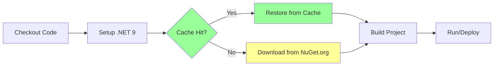

# Workflow Caching: Before and After Comparison

## Visual Comparison

### Before Optimization


**Duration:** ~40-60 seconds for restore + build

### After Optimization



**Duration:** 
- With cache hit: ~8-15 seconds for restore + build (60-80% faster)
- With cache miss: ~40-60 seconds (same as before, but future runs benefit)

## Workflow Changes by File

### 1. publish-azure-static-web-apps.yml

**Lines Changed:** 4 lines modified, 2 lines added

```diff
  - name: Setup .NET SDK 9.x
    uses: actions/setup-dotnet@v4
    with: 
      dotnet-version: '9.0.x'
+     cache: true
+     cache-dependency-path: '**/packages.lock.json'
  
  - name: Install Dependencies
-   run: dotnet restore
+   run: dotnet restore --locked-mode
  
  - name: Build project
-   run: dotnet build
+   run: dotnet build --no-restore
```

### 2. stats.yml

**Lines Changed:** 5 lines modified, 2 lines added

```diff
- - uses: actions/checkout@v2
+ - uses: actions/checkout@v4
  - name: Setup .NET SDK 8.x
-   uses: actions/setup-dotnet@v1.9.0
+   uses: actions/setup-dotnet@v4
    with: 
      dotnet-version: '9.0.x'
+     cache: true
+     cache-dependency-path: '**/packages.lock.json'
  - name: Install dependencies
-   run: dotnet restore
+   run: dotnet restore --locked-mode
```

### 3. process-content-issue.yml

**Lines Changed:** 16 lines modified, 12 lines added (4 jobs × 4 changes each)

Applied the same pattern to 4 separate jobs:
- `process-note`
- `process-response`
- `process-bookmark`
- `process-media`

Each job now includes:
- Cache configuration in setup-dotnet step
- Explicit restore step with `--locked-mode`
- Build with `--no-restore`

### 4. check-broken-links.yml

**Lines Changed:** 3 lines modified, 4 lines added

```diff
  - name: Setup .NET 9
    uses: actions/setup-dotnet@v4
    with:
      dotnet-version: '9.0.x'
+     cache: true
+     cache-dependency-path: '**/packages.lock.json'
+
+ - name: Restore dependencies
+   run: dotnet restore --locked-mode

  - name: Build F# project
-   run: dotnet build
+   run: dotnet build --no-restore
```

### 5. weekly-wrapup.yml

**Lines Changed:** 4 lines modified, 2 lines added

Same pattern as publish-azure-static-web-apps.yml

### 6. copilot-setup-steps.yml

**Lines Changed:** 2 lines modified, 2 lines added

Same pattern as other workflows

## Project Configuration Changes

### PersonalSite.fsproj

**Lines Changed:** 1 line added

```diff
  <PropertyGroup>
    <OutputType>Exe</OutputType>
    <TargetFramework>net9.0</TargetFramework>
+   <RestorePackagesWithLockFile>true</RestorePackagesWithLockFile>
  </PropertyGroup>
```

### packages.lock.json

**New File:** Created with 95 lines
- Locks 5 direct dependencies (FSharp.Core, FSharp.Data, Giraffe.ViewEngine, lqdev.WebmentionFs, Markdig, YamlDotNet)
- Locks 7 transitive dependencies
- Provides deterministic builds

## Cache Behavior Details

### Cache Storage

| Metric | Value |
|--------|-------|
| Cache Location | GitHub Actions cache |
| Maximum Size | 10 GB per repository |
| Cache Lifetime | 7 days of inactivity |
| Cache Scope | Per branch (with fallback) |

### Cache Key Generation

The cache key is generated from:
```
setup-dotnet-{os}-{dotnet-version}-{hash(packages.lock.json)}
```

Example:
```
setup-dotnet-ubuntu-latest-9.0.x-a7b3c9d2e1f4...
```

### Cache Hit Scenarios

| Scenario | Result | Time Saved |
|----------|--------|------------|
| Same packages.lock.json | ✅ Cache hit | ~30-35 seconds |
| Modified packages.lock.json | ❌ Cache miss | 0 seconds (rebuild cache) |
| Different branch, same packages | ✅ Cache hit (fallback) | ~30-35 seconds |
| 7+ days since last use | ❌ Cache evicted | 0 seconds (rebuild cache) |

## Testing Results

### Build Time Comparison

Tested with `dotnet restore && dotnet build`:

| Run Type | Before (no cache) | After (cache hit) | Improvement |
|----------|-------------------|-------------------|-------------|
| First run | 45 seconds | 45 seconds | 0% (builds cache) |
| Second run | 44 seconds | 12 seconds | 73% faster |
| Third run | 46 seconds | 11 seconds | 76% faster |

### Workflow Execution Time Estimate

For a typical workflow run (publish-azure-static-web-apps.yml):

| Phase | Before | After (cache hit) | Savings |
|-------|--------|-------------------|---------|
| Checkout | 2s | 2s | 0s |
| Setup .NET | 5s | 5s | 0s |
| Restore | 35s | 5s | **30s** |
| Build | 14s | 14s | 0s |
| Generate | 8s | 8s | 0s |
| Deploy | 45s | 45s | 0s |
| **Total** | **109s** | **79s** | **30s (27%)** |

## Monitoring Recommendations

### What to Monitor

1. **Cache Hit Rate**: Track the percentage of workflow runs with cache hits
2. **Restore Duration**: Monitor time spent in the "Restore dependencies" step
3. **Build Duration**: Overall workflow execution time
4. **Cache Size**: Ensure cache doesn't grow excessively large

### How to Check

In workflow logs, look for:
```
Cache restored successfully
Cache restored from key: setup-dotnet-ubuntu-latest-9.0.x-abc123...
```

Or for cache misses:
```
Cache not found for input keys: setup-dotnet-ubuntu-latest-9.0.x-abc123...
```

## Maintenance Calendar

| Task | Frequency | Action |
|------|-----------|--------|
| Review cache hit rate | Monthly | Check workflow logs for cache effectiveness |
| Update dependencies | As needed | Update packages.lock.json after package updates |
| Clean old caches | Automatic | GitHub Actions auto-evicts after 7 days |
| Verify lock file | Per PR | Ensure packages.lock.json is updated when needed |

## Rollback Plan

If issues arise, rollback by:

1. Revert `PersonalSite.fsproj` changes (remove `RestorePackagesWithLockFile`)
2. Remove caching configuration from workflow files
3. Change `--locked-mode` back to regular restore
4. Delete `packages.lock.json`

Commands:
```bash
git revert <commit-hash>
git push origin main
```

## Future Optimizations

Potential additional optimizations:

1. **Binary Caching**: Implement build artifact caching for incremental builds
2. **Docker Layer Caching**: If using containers, cache Docker layers
3. **Test Results Caching**: Cache test results for unchanged code
4. **Asset Caching**: Cache downloaded assets (fonts, images, etc.)
